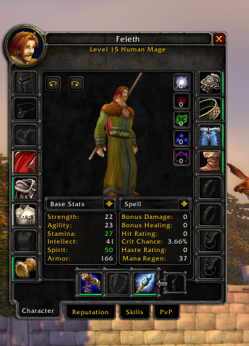
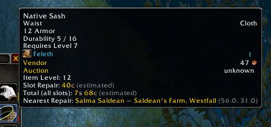
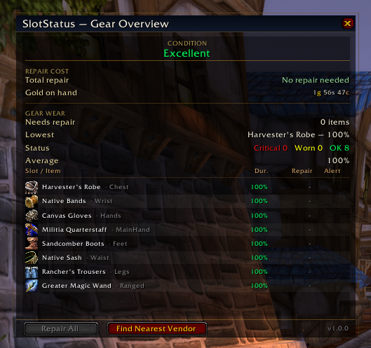
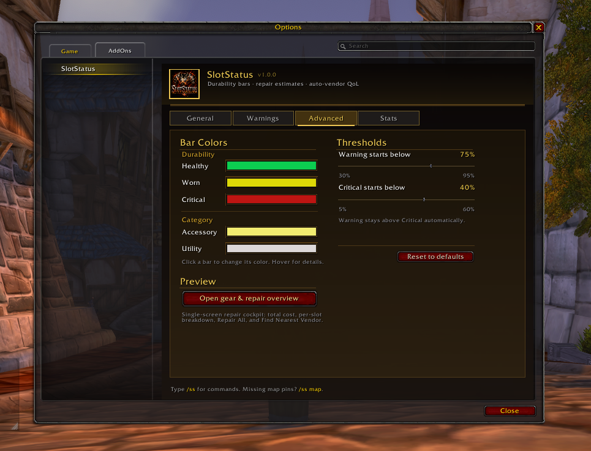

# SlotStatus

  
  
  
  

  <i>A lightweight but complete gear-maintenance addon for <b>World of Warcraft: Burning Crusade Classic (Anniversary)</b>.</i>

  
   
  <i>Color-coded durability bars update live on every equipment slot</i>

SlotStatus started as a simple idea — show durability bars directly on the Character Frame so you don't have to hover every slot to check your gear — and grew into a full suite for tracking, repairing, and maintaining your equipment without ever leaving the game.

Everything is **per-character**, stored locally, and works **out of the box**. No libraries, no dependencies, no setup required.

---

## Table of Contents

- [Features](#features)
  - [Durability Bars on the Character Frame](#durability-bars-on-the-character-frame)
  - [Rich Tooltips](#rich-tooltips)
  - [World Map Vendor Pins](#world-map-vendor-pins)
  - [Vendor Auto-Discovery](#vendor-auto-discovery)
  - [Automation at the Merchant](#automation-at-the-merchant)
  - [Warning System](#warning-system)
  - [Gear Overview Window](#gear-overview-window)
  - [Minimap Button & Broker Support](#minimap-button--broker-support)
  - [Full Options Panel](#full-options-panel)
- [Slash Commands](#slash-commands)
- [First-Run Welcome](#first-run-welcome)
- [Design Philosophy](#design-philosophy)
- [Installation](#installation)
- [Compatibility](#compatibility)
- [Feedback & Issues](#feedback--issues)
- [License](#license)

---

## Features

### Durability Bars on the Character Frame

Slim, color-coded bars sit flush against every equipment slot on the paperdoll. A single glance tells you which pieces are fine, which are worn, and which are about to break.

- **Healthy**, **Worn**, and **Critical** color tiers
- Special tints for **Accessory** and **Utility** slots
- Live updates when durability changes, gear swaps, or repairs happen
- Fully customizable colors, thresholds, alpha, thickness, and position

### Rich Tooltips

  
   
  <i>Hover any equipped item to see repair cost and the nearest repair vendor</i>

Hover any equipped item to see:

- **Item Level**
- **Slot Repair** — estimated cost to repair just that one piece
- **Total Repair Cost** — all slots combined
- **Nearest Repair Vendor** — name, subzone, zone, and coordinates
- A green **Repair here** callout when you're standing on one

### World Map Vendor Pins

Anvil icons appear on the world map marking every known repair vendor in the zone you're viewing. Pins refresh automatically as you open and resize the map.

### Vendor Auto-Discovery

SlotStatus ships with a built-in repair-vendor database and also **learns new vendors on its own**. The first time you open any merchant that can repair, SlotStatus records their name, zone, subzone, and exact coordinates. Over time you build a personal atlas of every repair vendor you've met.

> View the full list at any time with `/ss vendors`.

---

### Automation at the Merchant

Open any repair vendor and SlotStatus handles the boring parts for you — all toggleable:

- **Auto-Repair** — repairs everything the moment the merchant window opens
- **Guild Bank First** — if you have the withdraw cap, pulls repair costs from guild funds before touching your own gold
- **Auto-Sell Grays** — clears Poor-quality junk from your bags and reports the gold earned

Every transaction is tracked in the **Stats** tab so you know exactly how much you've spent and earned.

### Warning System

Three levels of heads-up so you never get caught with broken gear:

- **Low-Durability Warnings** — off, chat-only, or chat + on-screen flash + sound
- **Pre-Combat Warning** — fires the moment you enter combat with any slot below a configurable threshold
- **Animated Bar Pulse** highlights the exact slot that's in trouble

> Default thresholds: **25%** for the standard warning and **35%** for the pre-combat check — both adjustable.

---

### Gear Overview Window

  
   
  <i>At-a-glance gear condition, repair cost, and per-slot durability</i>

A custom-styled dialog you can open from the minimap button, a broker panel (Titan / Bazooka / ElvUI), or a slash command. It shows:

- **Condition** verdict — at-a-glance summary of your overall gear state
- **Repair Cost** block — total repair due vs gold on hand
- **Gear Wear** stat sheet — slots needing repair, your lowest-durability piece, a status verdict, and average durability
- **Slot Table** — every equipment slot with its current durability, color-coded to match the bars on your paperdoll

### Minimap Button & Broker Support

- Draggable minimap button, position remembered per character
- **Left-click** — opens the Gear Overview window
- **Right-click** — opens the options panel
- Exposes a **LibDataBroker-1.1** data source so Titan Panel, Bazooka, ElvUI DataBars, and other display addons can show your average durability on their bar
- **No dependency** — if no broker addon is loaded, SlotStatus silently does nothing and moves on

---

### Full Options Panel

  
   
  <i>Live preview, color pickers, and threshold sliders on the Advanced tab</i>

Accessible from **Interface Options** or `/ss options`. Four tabs:

| Tab          | Contents                                                                                                                                                |
| ------------ | ------------------------------------------------------------------------------------------------------------------------------------------------------- |
| **General**  | Display toggles, all three merchant automations, debug prints                                                                                           |
| **Warnings** | Warning mode, sound and flash, pre-combat warning, threshold sliders                                                                                    |
| **Advanced** | Five color pickers (Healthy, Worn, Critical, Accessory, Utility), live bar preview, G→Y and Y→R threshold sliders, bar alpha, thickness, offset sliders |
| **Stats**    | Session and lifetime gold in/out, with a **Reset** button                                                                                               |

> Every setting is saved **per character**.

---

## Slash Commands

| Command                          | What it does                     |
| -------------------------------- | -------------------------------- |
| `/ss` or `/slotstatus`           | Show help                        |
| `/ss options`                    | Open the options panel           |
| `/ss advanced`                   | Panel → Advanced tab             |
| `/ss stats`                      | Session gold in/out              |
| `/ss reset`                      | Reset session stats              |
| `/ss autorepair`                 | Toggle auto-repair               |
| `/ss autosell`                   | Toggle auto-sell grays           |
| `/ss guild`                      | Toggle "guild bank first"        |
| `/ss warn [N\|off\|chat\|full]`  | Warning mode and threshold       |
| `/ss pins`                       | Toggle map pins                  |
| `/ss mm`                         | Toggle minimap button            |
| `/ss vendors [clear]`            | List or clear discovered vendors |
| `/ss discover`                   | Toggle vendor auto-discovery     |
| `/ss welcome`                    | Re-open the welcome popup        |
| `/ss debug`                      | Toggle debug prints              |

---

## First-Run Welcome

New characters see a one-time welcome popup two seconds after login that explains how to open the addon and lists the main features. It appears **once per character**, then never again — re-openable anytime with `/ss welcome`.

---

## Design Philosophy

SlotStatus is designed to **stay out of your way**. It doesn't modify the Blizzard UI, doesn't add third-party frames you didn't ask for, and doesn't nag. It sits quietly on the Character Frame showing you what you need to know, and steps in only at the merchant window to save you a few clicks.

- No library dependencies
- No taint on the default UI
- Per-character saved variables
- Lightweight — minimal CPU and memory footprint

---

## Installation

### Option 1 — CurseForge (recommended)

Install via the [CurseForge app](https://www.curseforge.com/wow/addons) and search for **SlotStatus**.

### Option 2 — Manual install

1. Download the latest release ZIP from the [Releases page](../../releases).
2. Extract the `SlotStatus` folder into your WoW AddOns directory:
